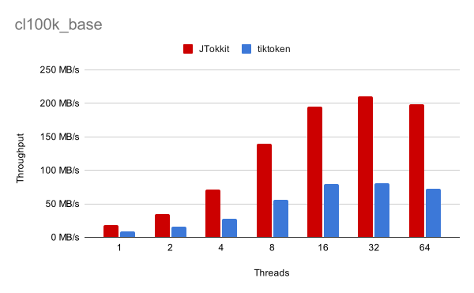

# 🚀 JTokkit - Java Tokenizer Kit

[](https://opensource.org/license/mit/)


[](https://javadoc.io/doc/com.knuddels/jtokkit)

Welcome to JTokkit, a Java tokenizer library designed for use with OpenAI models.
```java
EncodingRegistry registry = Encodings.newDefaultEncodingRegistry();
Encoding enc = registry.getEncoding(EncodingType.CL100K_BASE);
assertEquals("hello world", enc.decode(enc.encode("hello world")));

// Or get the tokenizer corresponding to a specific OpenAI model
enc = registry.getEncodingForModel(ModelType.TEXT_EMBEDDING_ADA_002);
```

## 💡 Quickstart

For a quick getting started, see our [documentation](https://jtokkit.knuddels.de/).

## 📖 Introduction
JTokkit aims to be a fast and efficient tokenizer designed for use in natural
language processing tasks using the OpenAI models. It provides an easy-to-use
interface for tokenizing input text, for example for counting required tokens
in preparation of requests to the GPT-3.5 model. This library resulted out of
the need to have similar capacities in the JVM ecosystem as the library
[tiktoken](https://github.com/openai/tiktoken) provides for Python.

## 🤖 Features

✅ Implements encoding and decoding via `r50k_base`, `p50k_base`, `p50k_edit`
and `cl100k_base`

✅ Easy-to-use API

✅ Easy extensibility for custom encoding algorithms

✅ **Zero** Dependencies

✅ Supports Java 8 and above

✅ Fast and efficient performance


🔨 Handling of special tokens during encoding (not started)

## 📊 Performance

JTokkit is between 2-3 times faster than a comparable tokenizer.



For details on the benchmark, see the [benchmark](benchmark) directory.

## 🛠️ Installation
You can install JTokkit by adding the following dependency to your Maven project:

```xml
<dependency>
    <groupId>com.knuddels</groupId>
    <artifactId>jtokkit</artifactId>
    <version>0.6.1</version>
</dependency>
```

Or alternatively using Gradle:

```groovy
dependencies {
    implementation 'com.knuddels:jtokkit:0.6.1'
}
```

## 🔰 Getting Started
To use JTokkit, simply create a new `EncodingRegistry` and use `getEncoding` to
retrieve the encoding you want to use. You can then use the `encode` and
`decode` methods to encode and decode text.

```java
EncodingRegistry registry = Encodings.newDefaultEncodingRegistry();
Encoding enc = registry.getEncoding(EncodingType.CL100K_BASE);
List<Integer> encoded = enc.encode("This is a sample sentence.");
// encoded = [2028, 374, 264, 6205, 11914, 13]
        
String decoded = enc.decode(encoded);
// decoded = "This is a sample sentence."

// Or get the tokenizer based on the model type
Encoding secondEnc = registry.getEncodingForModel(ModelType.TEXT_EMBEDDING_ADA_002);
// enc == secondEnc
```

The `EncodingRegistry` and `Encoding` classes are thread-safe and can be freely
shared among components.

## ➰ Extending JTokkit

You may want to extend JTokkit to support custom encodings. To do so, you have two
options:

1. Implement the `Encoding` interface and register it with the `EncodingRegistry`
```java
EncodingRegistry registry = Encodings.newDefaultEncodingRegistry();
Encoding customEncoding = new CustomEncoding();
registry.registerEncoding(customEncoding);
```
2. Add new parameters for use with the existing BPE algorithm
```java
EncodingRegistry registry = Encodings.newDefaultEncodingRegistry();
GptBytePairEncodingParams params = new GptBytePairEncodingParams(
        "custom-name",
        Pattern.compile("some custom pattern"),
        encodingMap,
        specialTokenEncodingMap
);
registry.registerGptBytePairEncoding(params);
```

Afterwards you can use the custom encodings alongside the default ones and access
them by using `registry.getEncoding("custom-name")`. See the JavaDoc for more
details.

## 📄 License
JTokkit is licensed under the MIT License. See the
[LICENSE](https://github.com/knuddelsgmbh/jtokkit/blob/main/LICENSE) file
for more information.
