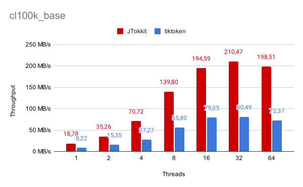
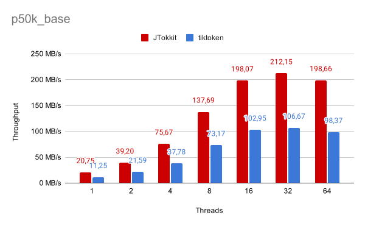
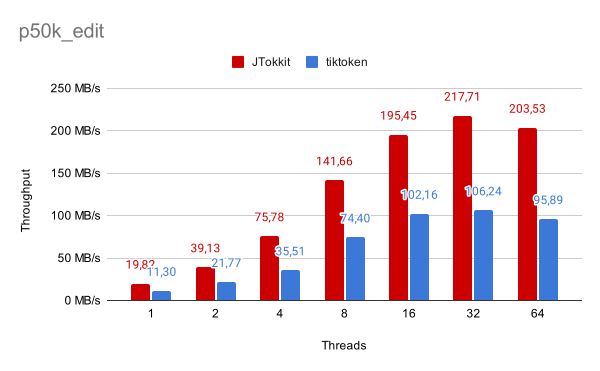

# About the Benchmark

The aim of this library is to be competitive with other tokenizers in terms of performance.
As a reference we used [tiktoken](https://github.com/openai/tiktoken).
Since JTokkit at the time of writing does not support encoding of special tokens
we used `encode_ordinary_batch` for comparison. For the exact configuration of
pyperf and jmh refer to the respective files. The raw reports can be found in the reports [directory](reports).

As input data, we used 400 books from the [Gutenberg project](https://www.gutenberg.org/)
ranging in size from 400kb to 6.5mb, for a total of 265mb of data. The machine the benchmark was
run on uses a AMD Ryzen 9 5900x (24 logical cores) with 64GB of RAM.
All books were fully loaded into memory before the measurement began.

## Results
Overall JTokkit seems to have 2 to 3 times higher throughput than tiktoken. Also, both
JTokkit and tiktoken parallelize equally well across multiple inputs. The graphics below
show the mean throughput of the different encodings using different amounts of threads.

Most of the execution time is spent in the regex. Since p50k_base, p50k_edit and r50k_base
use the same regex, the times of these encodings are very similar.

